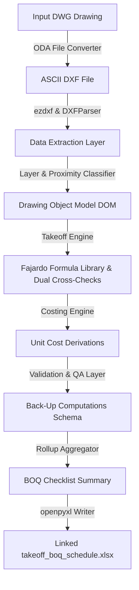

# Automated Quantity Takeoff and Bill of Quantities (BOQ) Generation System
## Objectives Statement, Technical Specifications, and Fajardo Formula Library

*   **Quantity Takeoff Method Basis**: Max Fajardo’s *Simplified Construction Estimate*
*   **Document Status**: Approved Baseline - v2.0 (Consolidated with Research Log Passes 1–5)
*   **Target Trades (Phase 1 Scope)**: Concrete Works, Steel Reinforcement, Masonry Works (CHB)

---

## 1. Objectives Statement

### 1.1 Project Title
Automated Quantity Takeoff and Bill of Quantities (BOQ) Generation System from Architectural and Structural Working Drawings.

### 1.2 General Objective
To develop a software system capable of ingesting structural and architectural CAD drawings (in DWG/DXF or vector PDF format) and automatically generating a costed Bill of Quantities (BOQ) using standardized quantity takeoff methods based on Max Fajardo’s *Simplified Construction Estimate*.

### 1.3 Specific Objectives
1.  **Ingestion & Parsing**: Parse DWG and DXF files (normalized via ODA File Converter CLI) to extract geometric and text entities (lines, polylines, layers, blocks, text annotations).
2.  **Element Extraction**: Identify and group drawing entities into structural elements (footings, columns, beams, slabs, walls) based on layers, block attributes, and schedule annotations.
3.  **Quantity Takeoff Computation**: Implement computational modules for Concrete Volume, Steel Reinforcement (rebar count, lengths, weights), and Masonry Works (CHB count, mortar volumes, plastering).
4.  **Fajardo Factors Integration**: Integrate standard material/labor ratios per unit based on Max Fajardo's guidelines (cement-sand-gravel mix ratios, CHB per sq.m. mortar factors, plastering coefficients, distinct mortar class scale).
5.  **Automated Dual Cross-Checking**: Implement automated multi-method validation rules per element type (e.g., Volume Method vs. Linear-Meter Method for columns; Area Method vs. Layer Count for CHB) to flag discrepancies prior to BOQ consolidation.
6.  **Costing & Consolidation**: Apply regional unit costs (materials and labor) to takeoff quantities and consolidate them into a linked, multi-sheet Excel workbook with live formulas.
7.  **Traceability & Verification**: Ensure each line item in the final BOQ is traceable back to its originating drawing elements, coordinates, and computation formulas.
8.  **Validation & QA Workflow**: Provide a verification mechanism allowing manual verification or override of automatically extracted values and applied unit costs.

### 1.4 Scope

#### 1.4.1 Phase 1 Core Scope
*   **Supported Trades**: Concrete Works, Steel Reinforcement, and Masonry Works (CHB) only. Both quantity takeoff AND costing are in scope for these three trades.
*   **Output**: A costed, multi-sheet Excel workbook (`.xlsx` via `openpyxl`) structured as:
    1.  **Back-Up Computation**: Row-by-row structural element takeoff details ($L \times W \times H \times \text{Qty}$) with live formulas.
    2.  **Checklist / BOQ Summary**: Rolled-up quantities grouped by trade items ($\text{Qty} \times \text{Unit Cost} = \text{Amount}$).
    3.  **Unit Cost Derivation**: Editable material and labor base prices, feeding live calculations in other sheets.
*   **Primary Input Format**: DWG files pre-converted to ASCII DXF via ODA File Converter CLI, and vector-exported PDF drawings.

#### 1.4.2 In-Scope vs. Out-of-Scope Structural Elements
*   **Concrete Works**:
    *   *In-scope*: Rectangular/square Isolated Footings, Rectangular/Square Columns, Rectangular Beams (clear spans), Suspended Slabs, and Slab-on-Grade.
    *   *Out-of-scope*: Stepped/battered footings, pile caps, circular beams, helical stairs, and composite metal decks.
*   **Steel Reinforcement**:
    *   *In-scope*: Longitudinal rebars, stirrups (transverse beam bars), column ties, slab temperature bars, and structural/dowel continuity bars.
    *   *Out-of-scope*: Structural steel shapes (wide-flange, angles), post-tensioning tendons, and non-structural embeds.
*   **Masonry Works (CHB)**:
    *   *In-scope*: $100\text{ mm}$ ($4"$) and $150\text{ mm}$ ($6"$) CHB walls, vertical/horizontal cell reinforcing rebars, mortar joint laying, and $16\text{ mm}$ plastering.
    *   *Out-of-scope*: $200\text{ mm}$ ($8"$) CHB walls, retaining walls, decorative brickworks, and specialized wall cladding.

#### 1.4.3 Exclusions, Assumptions, and Constraints
*   **Exclusions**: Non-structural trades (finishes, painting, drywall, roofing), MEPFS (Mechanical, Electrical, Plumbing, Fire Protection, Sanitary), and site development (earthworks). Formworks and scaffolding calculations are excluded from Phase 1.
*   **Assumptions**:
    *   *Scale & Unit Consistency*: Drawings are assumed to be drawn to scale with explicit unit definitions ($INSUNITS$).
    *   *Layer Integrity*: Entities are organized into distinct CAD layers.
    *   *Span Measurement Convention*: The drawing's span dimension convention (center-to-center vs. outer-to-outer column faces) is confirmed at ingestion per drawing set.
*   **Constraints**:
    *   *File Size*: DXF drawings up to $150\text{ MB}$ parsed locally in under 3 minutes.
    *   *Text Formats*: Annotations must be text entities (TEXT or MTEXT), not exploded paths.

---

## 2. Technical Specifications

### 2.1 Input Ingestion Module
1.  Ingest `.dwg` structural drawing.
2.  Convert to ASCII `.dxf` format via ODA File Converter CLI.
3.  Parse `.dxf` entities using Python’s `ezdxf` library and custom ASCII fallback parser.

### 2.2 Data Extraction Layer

| Source Type | Ingestion Library | Target Entities |
| :--- | :--- | :--- |
| **DWG / DXF (Vector)** | `ezdxf` / `dxf_parser.py` | `LINE`, `LWPOLYLINE` (with bulge/arc length), `TEXT`, `MTEXT`, `INSERT` (Blocks) |
| **PDF (Vector)** | `pdfplumber`, `PyMuPDF` | Vector path coordinates, text bounding boxes |
| **PDF (Scanned/Raster)** | Tesseract / PaddleOCR | Scanned pixels, lines, OCR character coordinates (Stretch Goal) |
| **Schedules** | Custom Table Parser | Text grid matching row/column cell boundaries |

### 2.3 Scale Calibration (Scanned/Raster PDF - Stretch Goal)
Detect dimension lines, cross-reference with OCR values, apply localized scaling coefficients, and fall back to manual calibration if sample variance is high.

### 2.4 Element Classification and Mapping
Cascading strategy:
1.  **Layer Name Matching**: Primary classification matching layers against a configurable alias list (e.g., `S-BEAM`, `C-FRAME`).
2.  **Block/Insert Name Matching**: Secondary matching of CAD blocks (e.g., matching block `COL_400x400`).
3.  **Schedule Cross-Referencing**: Spatial mapping of plan-view annotations (e.g., `GB-1`, `C-2`) to table records in structural schedules.
4.  **Heuristic Geometry Fallback**: Spatial proximity linking (`member_size_extractor.py`) connecting text labels to nearest geometry segments. Low-confidence items are flagged for review.

---

### 2.5 Quantity Takeoff Engine Methodology (§2.5)

#### 2.5.0 The Pattern Behind Every Fajardo Solution
Every worked calculation in Fajardo's methodology follows a strict sequence:
1.  **Reduce drawing to a net measurement**: Net length/area/volume (gross geometry minus post/column interruptions, openings, or overlapping elements).
2.  **Classify by category and count**: Group same-size/same-design elements ("Direct Counting Method") rather than solving each instance independently.
3.  **Multiply by relevant table factor**: Apply exact mix class, mortar class, or unit bar weight.
4.  **Automated Dual Cross-Checking**: Run at least two independently-derived calculations per element type. Flag divergence beyond $\approx 1\text{--}2\%$ for manual review.

#### 2.5.1 Concrete Module
*   **Typical-Member Grouping**: Group elements of identical cross-section and concrete class before running takeoff. Surface both per-instance and per-category sums in Back-Up Computations.
*   **Footings**: $V = L_{net} \times W \times H \times N$. **$L$ must be net**: gross wall-footing runs interrupted by posts/columns must have column footprints subtracted before calculation (e.g., 40.0m gross interrupted by 11 posts at 0.25m nets to 37.25m, avoiding a $\approx 7\%$ overstatement).
*   **Columns**: $V = W \times D \times H_{clear} \times N$. $H_{clear}$ excludes footing/pedestal thickness at bottom and beam depth at top. Column-beam joint overlap is assigned to the column.
*   **Beams**: $V = W \times D \times L_{clear} \times N$. $L_{clear}$ is net span between supporting column faces. Span measurement convention (center-to-center vs. outer-to-outer) is verified at ingestion. For monolithic floor beams, beam depth $D$ is measured below the slab soffit.
*   **Slabs**: $A_{net} = A_{gross} - \sum A_{openings}$; $V = A_{net} \times T$. Openings below $0.25\text{ m}^2$ are ignored by default.

#### 2.5.2 Steel Reinforcement Module
*   **Detailing Style Fork**: System supports explicit configuration `bar_detailing_style: bent | straight`. Modern straight-bar mat detailing is used by default; bent-bar/cranked detailing is selected when drawings specify cranked main bars.
*   **Main Reinforcement Counting**: Count = $(\text{Span} / \text{Spacing}) + 1$. Single bars and bundled bars (2–4 bars grouped) are categorized and priced as distinct element types.
*   **Column Main Bar Length**: $L_{main} = H_{architectural} + L_{splice} + L_{hook} + L_{dowel}$. Tracked independently from concrete clear height to prevent under-ordering steel across floor transitions.
*   **Column Ties Spacing & Count**: Spacing is $S = \min(16 \cdot d_{main}, 48 \cdot d_{tie}, \text{least column dimension})$. Tie count is $N_{tie} = (H_{clear} / S) + 1$. Tie minimum diameter is $\varnothing 10\text{ mm}$ for main bars $\le 32\text{ mm}$, and $\varnothing 12\text{ mm}$ for main bars $35\text{--}58\text{ mm}$ or bundled bars.
*   **Beam/Girder Reinforcement Taxonomy**:
    1. *Main reinforcement*: Straight bars, bent (cranked) bars, additional tension/compression cut bars, and dowel bars for future attachment.
    2. *Stirrups*: Open (U-shape) vs. Closed loops (torsion-resistant).
    3. *Cut bars*: Over support, between supports, hangers.
*   **Stirrup & Tie Optimization**: Direct-count stirrups per beam, compute cut length, select commercial stock length ($6.0\text{ m}$, $7.5\text{ m}$, $9.0\text{ m}$, $12.0\text{ m}$) prioritizing handling practicality, and always round order quantity up.
*   **Dowels Tagging**: Continuity dowels (footing-to-column, column-to-column) and attachment dowels (future work, partition/ceiling hangers) are counted and costed, with explicit tagging (`dowel_purpose: structural_continuity | future_work | ceiling_partition`).
*   **Tie Wire Methods**:
    * *CHB Reinforcement*: Flat $\text{kg-per-100-blocks}$ factor based on vertical/horizontal bar spacing.
    * *Footing Mats & Slabs*: Intersection counting (product of bar counts in both directions $\times 0.30\text{ m}$ tie length).
    * *Columns & Beams*: Flat $0.015\text{ kg}$ tie wire per kg rebar.
*   **Independent Footing Bar Length**: $L_{bar} = \text{footing\_dimension} - 2 \cdot \text{cover}$ (for unhooked mat bars).

#### 2.5.3 Masonry (CHB) Module
*   **Corner/Intersection Overlap**: Net out overlaps at L/T/+ wall intersections (one wall measured full length, perpendicular wall to inside face).
*   **Post/Column Deductions**: Subtract column footprints from wall run lengths before calculating block count (e.g., 60.0m perimeter with 4.0m total post width yields 56.0m net length = 1,820 pcs CHB vs. 1,950 pcs gross).
*   **Openings**: Net out rough opening areas of doors and windows.
*   **Thickness Split**: Separate $100\text{ mm}$ ($4"$) and $150\text{ mm}$ ($6"$) runs before applying unit block and mortar factors.
*   **Jamb Reinforcement**: Configurable toggle (default ON) adding vertical rebar at wall ends, corners, and door/window jambs.
*   **Dual Cross-Checks**:
    1. *CHB Count*: Area Method ($12.5\text{ pcs/m}^2$) vs. Fundamental perimeter/layer method.
    2. *CHB Reinforcement*: Direct Counting vs. Unit-CHB Method vs. Area Method.
    3. *Plastering*: Volume Method vs. Area Method.

---

### 2.6 Fajardo Formula Library (§2.6)

#### 2.6.1 Concrete Mix Designs (per $1\text{ m}^3$ of Concrete)

##### Option A: Using 40 kg Cement Bags
*   **Class AA** (1:1.5:3): Cement = $12.00\text{ bags}$, Sand = $0.50\text{ m}^3$, Gravel = $1.00\text{ m}^3$
*   **Class A** (1:2:4): Cement = $9.00\text{ bags}$, Sand = $0.50\text{ m}^3$, Gravel = $1.00\text{ m}^3$
*   **Class B** (1:2.5:5): Cement = $7.50\text{ bags}$, Sand = $0.50\text{ m}^3$, Gravel = $1.00\text{ m}^3$
*   **Class C** (1:3:6): Cement = $6.00\text{ bags}$, Sand = $0.50\text{ m}^3$, Gravel = $1.00\text{ m}^3$

##### Option B: Using 50 kg Cement Bags
*   **Class AA** (1:1.5:3): Cement = $9.50\text{ bags}$, Sand = $0.50\text{ m}^3$, Gravel = $1.00\text{ m}^3$
*   **Class A** (1:2:4): Cement = $7.20\text{ bags}$, Sand = $0.50\text{ m}^3$, Gravel = $1.00\text{ m}^3$
*   **Class B** (1:2.5:5): Cement = $6.00\text{ bags}$, Sand = $0.50\text{ m}^3$, Gravel = $1.00\text{ m}^3$
*   **Class C** (1:3:6): Cement = $4.80\text{ bags}$, Sand = $0.50\text{ m}^3$, Gravel = $1.00\text{ m}^3$

##### Concrete Waste Allowances & Commercial Stock
*   **Ready-Mix Concrete**: $3\%$ spillage factor.
*   **Site-Mixed Concrete**: $5\%$ handling factor.
*   **Bar Stock Lengths**: $6.0\text{ m}$, $7.5\text{ m}$, $9.0\text{ m}$, $10.5\text{ m}$, $12.0\text{ m}$.

#### 2.6.2 Steel Reinforcement Specifications

##### Theoretical Unit Weights (PNS 49 / ASTM A615)
*   $\varnothing 10\text{ mm}$: $0.617\text{ kg/m}$
*   $\varnothing 12\text{ mm}$: $0.888\text{ kg/m}$
*   $\varnothing 16\text{ mm}$: $1.578\text{ kg/m}$
*   $\varnothing 20\text{ mm}$: $2.466\text{ kg/m}$
*   $\varnothing 25\text{ mm}$: $3.853\text{ kg/m}$
*   $\varnothing 28\text{ mm}$: $4.834\text{ kg/m}$
*   $\varnothing 32\text{ mm}$: $6.313\text{ kg/m}$

##### Lap Splice Length Rules ($40 \cdot d_b$)
*   $\varnothing 10\text{ mm}$: $400\text{ mm}$ | $\varnothing 12\text{ mm}$: $500\text{ mm}$ | $\varnothing 16\text{ mm}$: $650\text{ mm}$ | $\varnothing 20\text{ mm}$: $800\text{ mm}$ | $\varnothing 25\text{ mm}$: $1000\text{ mm}$

##### Rebar Bend and Hook Allowances
*   **$90^{\circ}$ Standard Bend**: $12 \cdot d_b$
*   **$180^{\circ}$ Standard Hook**: $4 \cdot d_b$ or $65\text{ mm}$ (whichever is greater).
*   **$135^{\circ}$ Stirrup/Tie Hook**: $6 \cdot d_b$ or $75\text{ mm}$ (whichever is greater).

##### G.I. Tie Wire Factor
*   **General Ratio**: $0.015\text{ kg}$ #16 G.I. wire per kg rebar ($15\text{ kg/tonne}$).

#### 2.6.3 Masonry (CHB) & Mortar Factors

##### CHB Block Count
*   **Block Factor**: $12.5\text{ pcs/m}^2$ net wall surface area (for both $100\text{ mm}$ and $150\text{ mm}$ walls).

##### Mortar Class Scale (Distinct from Concrete Mix Scale)
Mortar and plaster use a dedicated scale (Class A, B, C, D) per $1\text{ m}^3$ of mortar:

| Mortar Class | Proportion | Cement (40kg bags) | Cement (50kg bags) | Sand ($\text{m}^3$) |
| :--- | :--- | :--- | :--- | :--- |
| **Class A** | 1 : 2 | 18.0 | 14.5 | 1.0 |
| **Class B** | 1 : 3 | 12.0 | 9.5 | 1.0 |
| **Class C** | 1 : 4 | 9.0 | 7.0 | 1.0 |
| **Class D** | 1 : 5 | 7.5 | 6.0 | 1.0 |

##### Laying Mortar & Cell Fill per $1\text{ m}^2$ Wall (Class B Mortar)
*   **$100\text{ mm}$ ($4"$) CHB Wall**: Cement = $0.522\text{ bags}$ ($40\text{ kg}$), Sand = $0.0435\text{ m}^3$
*   **$150\text{ mm}$ ($6"$) CHB Wall**: Cement = $1.01\text{ bags}$ ($40\text{ kg}$), Sand = $0.084\text{ m}^3$

##### Plastering per $1\text{ m}^2$ Wall Surface ($16\text{ mm}$ thick, Class B Plaster)
*   **One Face**: Cement = $0.192\text{ bags}$ ($40\text{ kg}$), Sand = $0.016\text{ m}^3$
*   **Two Faces (Standard)**: Cement = $0.384\text{ bags}$ ($40\text{ kg}$), Sand = $0.032\text{ m}^3$

---

## 2.7 Validation / QA Layer
*   **Dual Calculation Cross-Checking**: The engine automatically computes elements using two independent derivation methods (e.g., Volume Method vs. Linear Meter Method for columns). Items diverging by $>2\%$ are flagged.
*   **Confidence Scoring**: Every extracted element carries a confidence metric ($0.0\text{--}1.0$).
*   **Status Workflow**: Items track validation states: `Confirmed`, `Surveyed`, `N/A`, or `Included in other item`.

---

## 2.8 BOQ Consolidation Module

### 2.8.1 Back-Up Computation Table
Tracks individual element takeoff details: `project_id`, `work_section`, `item_code`, `location_description`, `drawing_ref`, `l_or_area`, `w`, `h_or_t`, `no`, `quantity`, `unit`, `unit_cost`, `amount`, `status`, `notes`.

### 2.8.2 Itemized Checklist / Summary Table
Rolls up Back-Up Computations: `item_no`, `item_code`, `description`, `unit`, `qty`, `unit_cost`, `amount`, `status`.

---

## 2.9 Output Module
*   **Excel Export**: Multi-sheet workbook (`.xlsx` via `openpyxl`) featuring live inter-sheet formulas across Back-Up Computation, Checklist BOQ Summary, and Unit Cost Derivation sheets.
*   **PDF Export**: Formal BOQ summary reports via `WeasyPrint` or `reportlab`.

---

## 2.10 Suggested Technology Stack

| Component | Library / Tool | Description |
| :--- | :--- | :--- |
| **DWG → DXF Conversion** | ODA File Converter CLI | Converts DWG to ASCII DXF |
| **DXF Parsing** | `ezdxf` / `dxf_parser.py` | Extracts geometric entities (with bulge/arc length) and text |
| **Takeoff Engine** | Python (`fajardo_takeoff_engine.py`) | Core volume, rebar, and masonry Fajardo rule calculations |
| **Excel Generator** | `openpyxl` (`boq_excel_generator.py`) | Writes structured workbooks with live Excel formulas |
| **QA & Verification** | Python (`run_full_qa_audit.py`) | Audits script syntax, Excel formula integrity, and logs |
| **Data Storage** | PostgreSQL / Supabase | Relational schema (`boq_schema.sql`) for DOM and takeoff tables |

---

## 2.11 System Architecture Overview

---

## 3. Revision Log, Open Items & Research Log

### 3.1 Consolidated Open Items
1.  **CHB tie-wire table**: 17/18 cells unverified (one point verified: 80cm vert / 3rd-layer / 25cm ties = $0.0016\text{ kg/block}$).
2.  **Masonry mortar/plaster sand factors**: Baseline vs. research figures diverge slightly; verify against physical copy.
3.  **Rebar detailing convention**: Confirm bent vs. straight preference per project from target structural drawings.
4.  **1.20m footing bar-length worked figure**: Formula trusted over specific worked figure.
5.  **Corner/jamb CHB reinforcement default**: Set to ON by default; confirm per project.
6.  **Confinement-zone stirrup spacing**: Variable spacing in heavy seismic zones flagged for Phase 2 refinement.
7.  **Minimum opening-area threshold**: Set to $0.25\text{ m}^2$ default.
8.  **Book edition alignment**: Fajardo 3rd Edition selected as primary baseline reference.
9.  **Span measurement convention**: Must be confirmed per drawing set at ingestion.
10. **Dowel scoping**: Tag future-work and partition dowels under distinct sub-categories.
11. **Bundled bar rules**: To be activated if target drawings contain bundled main column bars.
12. **Inner vs. outer column ties**: Outer ties modeled for typical columns; schema supports inner ties for large columns.

### 3.2 Chronological Research Log (Passes 1–5)
*   **Pass 1 & 2 (~T1–T2)**: Verified concrete mix design tables; confirmed distinct mortar class scale (A/B/C/D); identified rebar bent-vs-straight detailing fork; confirmed CHB post-deduction impact ($\approx 7\%$ overstatement if skipped); established dual-method cross-check pattern.
*   **Pass 3 (~T3)**: Recovered independent footing bar length formula; identified rebar intersection-counting method for mats; derived column tie spacing rules ($16 \cdot d_{main}, 48 \cdot d_{tie}, \text{least dim}$); recovered CHB tie wire factor ($0.0016\text{ kg/block}$).
*   **Pass 4 (~T4)**: Confirmed 3-category beam reinforcement taxonomy (main / stirrups / cut bars); differentiated closed vs. open stirrups for torsion; established 3 CHB cross-check methods.
*   **Pass 5 (~T5)**: Verified span measurement convention check as mandatory ingestion prerequisite; categorized "dowels for future attachment" and "partition hangers" as distinct rebar line items; confirmed bundled bar taxonomy; flagged Comparative Cost Analysis (RC wall vs. CHB wall) as candidate Phase 2 feature.
