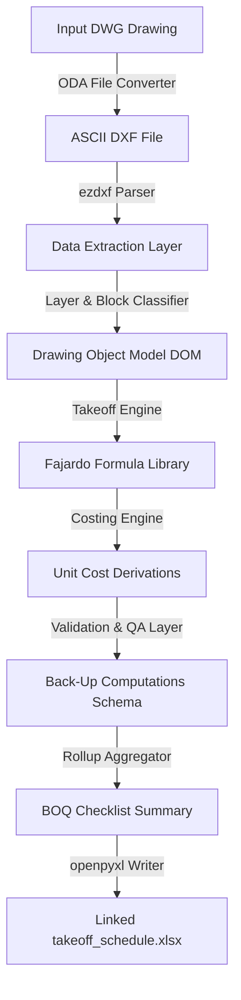

# Automated Quantity Takeoff and Bill of Quantities (BOQ) Generation System
## Objectives Statement and Technical Specifications

*   **Quantity Takeoff Method Basis**: Max Fajardo’s Simplified Construction Estimate
*   **Document Status**: Approved Baseline - v1.0
*   **Target Trades (Phase 1)**: Concrete Works, Steel Reinforcement, Masonry Works (CHB)

---

## 1. Objectives Statement

### 1.1 Project Title
Automated Quantity Takeoff and Bill of Quantities (BOQ) Generation System from Architectural and Structural Working Drawings.

### 1.2 General Objective
To develop a software system capable of ingesting structural and architectural CAD drawings (in DWG/DXF format) and automatically generating a costed Bill of Quantities (BOQ) using standardized quantity takeoff methods based on Max Fajardo’s Simplified Construction Estimate.

### 1.3 Specific Objectives
1.  **Ingestion & Parsing**: Parse DWG and DXF files to extract geometric and text entities (lines, polylines, layers, blocks, text annotations).
2.  **Element Extraction**: Identify and group drawing entities into structural elements (footings, columns, beams, slabs, walls) based on layers and block attributes.
3.  **Quantity Takeoff Computation**: Implement computational modules for Concrete Volume, Steel Reinforcement (rebar count, lengths, weights), and Masonry Works (CHB count, mortar volumes, plastering).
4.  **Fajardo Factors Integration**: Integrate standard material/labor ratios per unit based on Max Fajardo's guidelines (cement-sand-gravel mix ratios, CHB per sq.m. mortar factors, plastering coefficients).
5.  **Costing & Consolidation**: Apply regional unit costs (materials and labor) to takeoff quantities and consolidate them into a linked, multi-sheet Excel workbook.
6.  **Traceability & Verification**: Ensure each line item in the final BOQ is traceable back to its originating drawing elements, coordinates, and computation formulas.

### 1.4 Scope

#### 1.4.1 Phase 1 Core Scope
*   **Supported Trades**: Concrete Works, Steel Reinforcement, and Masonry Works (CHB) only.
*   **Output**: A costed, three-sheet Excel workbook:
    1.  **Back-Up Computation**: Row-by-row structural element takeoff details ($L \times W \times H \times \text{Qty}$) with live formulas.
    2.  **Checklist / BOQ**: Rolled-up quantities grouped by trade items ($\text{Qty} \times \text{Unit Cost} = \text{Amount}$).
    3.  **Unit Cost Derivation**: Editable material and labor base prices, feeding calculations in other sheets.
*   **Primary Input Format**: DWG files pre-converted to ASCII DXF via ODA File Converter CLI.

#### 1.4.2 In-Scope vs. Out-of-Scope Structural Elements
*   **Concrete Works**:
    *   *In-scope*: Rectangular/square Isolated Footings, Rectangular/Circular Columns, Rectangular Beams (clear spans), Suspended Slabs, and Slab-on-Grade.
    *   *Out-of-scope*: Stepped/battered footings, pile caps, circular beams, helical stairs, and composite metal decks.
*   **Steel Reinforcement**:
    *   *In-scope*: Longitudinal rebars, stirrups (transverse beam bars), column ties, and slab temperature bars.
    *   *Out-of-scope*: Dowels/footing connection bars, structural steel shapes (wide-flange, angles), and post-tensioning tendons.
*   **Masonry Works (CHB)**:
    *   *In-scope*: $100\text{ mm}$ ($4"$) and $150\text{ mm}$ ($6"$) CHB walls, vertical/horizontal cell reinforcing rebars, mortar joint laying, and $16\text{ mm}$ plastering on both faces.
    *   *Out-of-scope*: $200\text{ mm}$ ($8"$) CHB walls, retaining walls, decorative brickworks, and wall finishes.

#### 1.4.3 Exclusions, Assumptions, and Constraints
*   **Exclusions**: Non-structural trades (finishes, painting, drywall, roofing), MEPFS (Mechanical, Electrical, Plumbing, Fire Protection, Sanitary), and site development (earthworks) are excluded from Phase 1. Formworks and scaffolding calculations are also excluded.
*   **Assumptions**:
    *   *Scale Consistency*: Drawing layouts are assumed to be drawn to a consistent scale.
    *   *Layer Integrity*: Drawing entities of different trades must be organized into distinct layers (e.g., beams should not be on the same layer as furniture).
    *   *Orthogonal Alignment*: Structural frames are assumed to align with the primary X and Y axes.
*   **Constraints**:
    *   *File Size*: Large DXF drawings up to $150\text{ MB}$ must be parsed locally in under 3 minutes.
    *   *Text Formats*: Annotations must be text entities (TEXT or MTEXT), not exploded lines.

---

## 2. Technical Specifications

### 2.1 Input Ingestion Module
*   **Primary Pipeline**: 
    1. Ingest `.dwg` structural drawing.
    2. Convert to ASCII `.dxf` format via ODA File Converter CLI.
    3. Load `.dxf` into the parser using Python’s `ezdxf` library.
*   **Secondary Pipeline (Stretch Goal)**: Parse vector-exported `.pdf` files using `pdfplumber` or `PyMuPDF`.

### 2.2 Data Extraction Layer

| Source Type | Ingestion Library | Target Entities |
| :--- | :--- | :--- |
| **DWG / DXF (Vector)** | `ezdxf` | `LINE`, `LWPOLYLINE`, `TEXT`, `MTEXT`, `INSERT` (Blocks) |
| **PDF (Vector)** | `pdfplumber`, `PyMuPDF` | Vector path coordinates, text bounding boxes |
| **PDF (Scanned/Raster)** | Tesseract / PaddleOCR | Scanned pixels, lines, OCR character coordinates (Stretch Goal) |
| **Schedules** | Custom Table Parser | Text grid matching row/column cell boundaries |

### 2.3 Scale Calibration (Scanned/Raster PDF - Stretch Goal)
*   **Scale Identification**: Detect dimension lines and cross-reference them with OCR text values.
*   **Calibration mapping**: Apply a localized scaling coefficient to account for scanner skew or page distortions, falling back to manual pixel-to-millimeter calibration if sample variance is high.

### 2.4 Element Classification and Mapping
Classification resolves structural entities using a cascading strategy:
1.  **Layer Name Matching**: Primary classification matching layers against a configurable alias list (e.g., `S-BEAM`, `C-FRAME`).
2.  **Block/Insert Name Matching**: Secondary matching of CAD blocks (e.g., matching block `COL_400x400` to Column Element).
3.  **Schedule Cross-Referencing**: Spatial mapping of plan-view annotations (e.g., `GB-1`, `C-2`) to table records in the structural schedules.
4.  **Heuristic Geometry Fallback**: Fallback checks for unlabeled lines (e.g., classifying closed rectangular polylines on column layers as columns). Low-confidence items are flagged for manual review.

### 2.5 Quantity Takeoff Engine
The takeoff engine operates as independent sub-modules that reference the **Fajardo Formula Library**:

#### 2.5.1 Concrete Module
*   **Isolated Footings**: $V = L \times W \times H \times N$
*   **Columns**: $V = W \times D \times H_{clear} \times N$ (where $H_{clear}$ is columns clear height between slabs/footings).
*   **Beams**: $V = W \times D \times L_{clear} \times N$ (where $L_{clear}$ is beam span between column faces).
*   **Slabs**: $V = A_{net} \times T$ (deducting elevator/stairwell openings).

#### 2.5.2 Steel Reinforcement Module
*   **Longitudinal Bar Length**: $L_{cut} = L_{clear} + 2 \cdot L_{dev} + \text{lap allowance}$
*   **Stirrups & Column Ties**: $L_{cut} = 2 \cdot (W_{clear} + H_{clear}) + 2 \cdot \text{Hook Allowance} - \text{Bend Deduction}$
*   **Unit Weight Conversion**: Weight is calculated as $M = L_{cut} \times W_{kg/m}$ utilizing the theoretical unit weights per diameter.
*   **Cutting Stock Heuristics**: Map cut lengths to standard commercial lengths ($6.0\text{ m}$, $7.5\text{ m}$, $9.0\text{ m}$, $10.5\text{ m}$, $12.0\text{ m}$) to optimize material yields.

#### 2.5.3 Masonry Module
*   **Gross Wall Area**: $A_{gross} = L \times H$
*   **Net Wall Area**: $A_{net} = A_{gross} - \sum A_{openings}$ (deducting windows and doors from architectural schedules).
*   **CHB Unit Count**: $N_{chb} = A_{net} \times 12.5\text{ pcs/m}^2$
*   **Mortar & Plaster Volume**: Volume is computed using wall area and plaster thickness ($16\text{ mm}$ standard).

---

## 2.6 Fajardo Formula Library

All quantity calculations reference standard parameters. The system supports swapping mix designs or standards (e.g., 40kg vs 50kg bags) without affecting engine logic.

### 2.6.1 Concrete Mix Designs (per $1\text{ m}^3$ of Concrete)

#### Option A: Using 40 kg Cement Bags
*   **Class AA** (1:1.5:3): Cement = $12.00\text{ bags}$, Sand = $0.50\text{ m}^3$, Gravel = $1.00\text{ m}^3$
*   **Class A** (1:2:4): Cement = $9.00\text{ bags}$, Sand = $0.50\text{ m}^3$, Gravel = $1.00\text{ m}^3$
*   **Class B** (1:2.5:5): Cement = $7.50\text{ bags}$, Sand = $0.50\text{ m}^3$, Gravel = $1.00\text{ m}^3$
*   **Class C** (1:3:6): Cement = $6.00\text{ bags}$, Sand = $0.50\text{ m}^3$, Gravel = $1.00\text{ m}^3$

#### Option B: Using 50 kg Cement Bags
*   **Class AA** (1:1.5:3): Cement = $9.50\text{ bags}$, Sand = $0.50\text{ m}^3$, Gravel = $1.00\text{ m}^3$
*   **Class A** (1:2:4): Cement = $7.20\text{ bags}$, Sand = $0.50\text{ m}^3$, Gravel = $1.00\text{ m}^3$
*   **Class B** (1:2.5:5): Cement = $6.00\text{ bags}$, Sand = $0.50\text{ m}^3$, Gravel = $1.00\text{ m}^3$
*   **Class C** (1:3:6): Cement = $4.80\text{ bags}$, Sand = $0.50\text{ m}^3$, Gravel = $1.00\text{ m}^3$

#### Concrete Waste Allowances
*   **Ready-Mix**: $3\%$ spillage factor.
*   **Site-Mixed**: $5\%$ handling and mixing factor.

### 2.6.2 Steel Reinforcement Specifications

#### Theoretical Unit Weights (PNS 49 / ASTM A615)
*   $\varnothing 10\text{ mm}$: $0.617\text{ kg/m}$
*   $\varnothing 12\text{ mm}$: $0.888\text{ kg/m}$
*   $\varnothing 16\text{ mm}$: $1.578\text{ kg/m}$
*   $\varnothing 20\text{ mm}$: $2.466\text{ kg/m}$
*   $\varnothing 25\text{ mm}$: $3.853\text{ kg/m}$
*   $\varnothing 28\text{ mm}$: $4.834\text{ kg/m}$
*   $\varnothing 32\text{ mm}$: $6.313\text{ kg/m}$

#### Lap Splice Length Rules
*   **General Tension / Compression Lap Splice**: $40 \cdot d_b$
    *   $\varnothing 10\text{ mm}$ lap length: $400\text{ mm}$
    *   $\varnothing 12\text{ mm}$ lap length: $500\text{ mm}$
    *   $\varnothing 16\text{ mm}$ lap length: $650\text{ mm}$
    *   $\varnothing 20\text{ mm}$ lap length: $800\text{ mm}$
    *   $\varnothing 25\text{ mm}$ lap length: $1000\text{ mm}$

#### Rebar Bend and Hook Allowances
*   **$90^{\circ}$ Standard Bend**: Hook length = $12 \cdot d_b$
*   **$180^{\circ}$ Standard Hook**: Hook length = $4 \cdot d_b$ or $65\text{ mm}$ (whichever is greater).
*   **$135^{\circ}$ Stirrup/Tie Hook**: Hook length = $6 \cdot d_b$ or $75\text{ mm}$ (whichever is greater).

#### G.I. Tie Wire Factor
*   **Tie Wire Quantity**: $0.015\text{ kg}$ of #16 G.I. Tie Wire per kg of reinforcing steel ($15\text{ kg}$ per metric ton).

### 2.6.3 Masonry (CHB) & Mortar Factors

#### CHB Block Count
*   **Count Factor**: $12.5\text{ pcs/m}^2$ of net wall surface area (for both $100\text{ mm}$ and $150\text{ mm}$ wall thicknesses).

#### Laying Mortar joint & Cell Fill (per $1\text{ m}^2$ of wall, Class B mortar)
*   **$100\text{ mm}$ ($4"$) CHB Wall**: Cement = $0.582\text{ bags}$ ($40\text{ kg}$), Sand = $0.0444\text{ m}^3$
*   **$150\text{ mm}$ ($6"$) CHB Wall**: Cement = $1.010\text{ bags}$ ($40\text{ kg}$), Sand = $0.0760\text{ m}^3$

#### Plastering (1 face, 16mm thick, Class B plaster)
*   **Plaster Factor**: Cement = $0.222\text{ bags}$ ($40\text{ kg}$), Sand = $0.0162\text{ m}^3$
    *   *Note: Standard CHB walls require plastering on both faces ($2\text{ faces/m}^2$ of wall area).*

---

## 2.7 Validation / QA Layer
*   **Confidence Scoring**: Every drawing element and calculation carries a confidence rating (based on text OCR clarity, geometry alignments, or layer matches).
*   **Error Flagging**: The system flags double-counted elements, overlapping geometries, or missing schedule records.
*   **Status Workflow**: Each takeoff item tracks validation states: `Confirmed`, `Surveyed`, `N/A`, or `Included in other item`.

---

## 2.8 BOQ Consolidation Module

The system exports two linked tables matching the database relational schemas:

### 2.8.1 Back-Up Computation Table
Each row tracks an individual extracted element's takeoff details:
*   `project_id`: UUID
*   `work_section`: e.g., `"II. Concrete Works"`
*   `item_code`: e.g., `CON-2.1` (Concrete columns)
*   `location_description`: Grid reference or member tag, e.g., `"Column C-1 at Grid B-3"`
*   `drawing_ref`: Drawing sheet code, e.g., `"S-1 Sheet 1"`
*   `l_or_area`, `w`, `h_or_t`, `no`: Raw geometric inputs.
*   `quantity`: Computed volume, area, weight, or count.
*   `unit`: `cu.m.`, `sq.m.`, `kg`, `pc`
*   `unit_cost`: Derived cost based on the material mix inputs.
*   `amount`: Quantity $\times$ Unit Cost (Calculated field).
*   `status`: Validation status.

### 2.8.2 Itemized Checklist / Summary Table
Each row rolls up the Back-Up Computations:
*   `item_no`: e.g., `2.1`
*   `item_code`: Matches `item_code` in Back-Up Computations.
*   `description`: e.g., `"Concrete Works - Columns"`
*   `unit`: Rollup unit (e.g., `cu.m.`)
*   `qty`: Total sum of confirmed back-up quantities.
*   `unit_cost`: Blended rate from Unit Cost Derivations.
*   `amount`: Rolled up subtotal amount.
*   `status`: Overall validation state.

---

## 2.9 Output Module
*   **Excel Export**: Multi-sheet workbook (`.xlsx`) using `openpyxl`.
    *   *Live Formulas*: Inter-sheet formulas (`VLOOKUP`, `SUM`, arithmetic cells) are written to allow the sheet to dynamically recalculate when price variables change.
    *   *Recalculation*: The Unit Cost Derivation sheet contains editable input cells for cement, sand, gravel, and rebar base unit rates.
*   **PDF Export**: Formal print-ready BOQ summary reports using `WeasyPrint` or `reportlab`.

---

## 2.10 Suggested Technology Stack

| Component | Library / Tool | Description |
| :--- | :--- | :--- |
| **DWG → DXF Conversion** | ODA File Converter CLI | Converts proprietary DWG files to open DXF ASCII files |
| **DXF Parsing** | `ezdxf` (Python) | Extracts vectors (lines, circles) and text/block tags |
| **PDF Extraction** | `pdfplumber` / `PyMuPDF` | Extracts vector lines, layouts, and text layers from PDFs |
| **Orchestration / API** | Python (FastAPI / Typer CLI) | Core takeoff engine logic and application runner |
| **Data Storage** | PostgreSQL / Supabase | Relational data store for DOM, mixes, and output tables |
| **Excel Generation** | `openpyxl` | Writes structured workbooks with live Excel formulas |
| **Frontend QA UI** | React / TailwindCSS | User interface for auditing, overriding, and confirming takeoff items |

---

## 2.11 System Architecture Overview

---

## 3. Revision Log & Open Items

### 3.1 Resolved in v1.0
*   Defined explicit scope boundaries, exclusions, assumptions, and constraints for Phase 1.
*   Populated the **Fajardo Formula Library** with standard parameters for Concrete mixes (40kg and 50kg bag options), Rebar weights, lap splices, hooks, CHB block counts, joint mortars, and plastering factors.
*   Enforced live formula exports in the Output Module specifications.

### 3.2 Still Open
*   **React Frontend Mockup**: Detail specific fields and interactions for the QA/override UI.
*   **Piecewise Scale Calibration**: Complete the detailed algorithm specifications for scanned/raster PDF scaling mappings (Stretch Goal).
